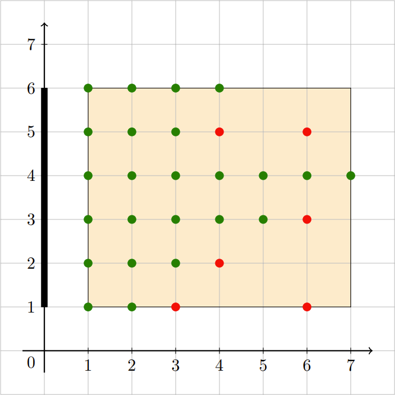

### B:[Spirit Circle Observation](https://ac.nowcoder.com/acm/contest/33186/B)

#### LyFive

##### 标签

后缀自动机(SAM)

##### 题意

给一个长度为n个数字串（有前导零）。计算这个数字串中有多少对子串$A,B$（A，B均为可能存在前导零的数字）满足$len(A)=len(B),A = B + 1$。

##### 思路

不难发现，我们可以考虑对于一个串$X$不存在9，在$X$后加入一个$i,i+1$就能凑出$A,B$对。由于是对子串的匹配联想到$sam$的$endpos$的性质$endpos$大小意味着某个子串出现的次数，$sam$每一个状态对应一个$endpos$，设此刻为状态$x$分别接收$i,i+1$转移到$x_i,x_j$，此时$x_i,x_j$状态表示的子串恰好凑成$A,B$对，并且对答案的贡献为$x_i,x_j$的$endpos$大小乘积，即$E(x_i)\times E(x_j)$。同时状态$x$表示子串的个数为$len(x)-len(Link(x))$，故状态$x$转移至$x_i,x_j$的答案贡献为

$$
(len(x)-len(Link(x))\times E(x_i)\times E(x_j)
$$

为此，遍历所有的状态判断转移方向累计答案即可。
对于特殊情况含有字符9的状态，考虑9进位后者进1并将9归0，故可以表示为$x_i,x_j$分别转移到$x_i+9,x_j+0$，故对于特殊情况9可以在每次转移到$x_i,x_j$后枚举9的情况。

??? note "参考代码"
    ```cpp
    --8<-- "docs/sol/code/nowcoder/schools2022_1_B.cpp"
    ```

***
### C:[Grab the Seat!](https://ac.nowcoder.com/acm/contest/33186/C)

#### z3475

##### 标签

单调队列,计算几何

##### 题意

在二维坐标系中$(1,1)$到$(n,m)$的矩阵包含的整数点为座位，$(0,1)$到$(0,m)$为电视，一个座位为好座位当且仅当它和电视形成的三角形内没有人。给定其他同学坐的位置，每个回合都有一个人移动位置坐，求每个回合后好位子数量。



##### 思路

考虑人对位置的影响，发现一个人$(x,y)$会ban掉所有$(0,1)$到$(x,y)$为方向，以$(x,y)$为开始的射线和$(0,m)$到$(x,y)$的射线围着的座位。考虑一边，另一边可以以同样的方法算出。取min即可。

发现对于所有人形成从$(x,y)$开始的所有以$k$为斜率的射线中，$k$和$y$值构成了一个单调队列like的形式，即如果$k_1>k_2$且其$y_1<y_2$，则前者完全可以替代掉后者，按斜率排序后添加至单调队列就可以维护每一个y对应的最小x值。


??? note "参考代码"
    ```cpp
    --8<-- "docs/sol/code/nowcoder/schools2022_1_C.cpp"
    ```

***
### I:[Chiitoitsu](https://ac.nowcoder.com/acm/contest/33186/I)
#### LyFive
##### 标签
DP,期望DP
##### 题意
牌库总共34×4张牌，起手摸13张。玩家每次摸一张牌丢一张牌，直到摸到恰好凑成7对牌后胜利。现求最优策略到达胜利所需摸牌数的期望。

##### 思路
不难发现最优策略就是保留手上的单牌，若摸一张不是手上的单牌就丢掉，否则就保留。现设$dp[i][j]$为还缺$i$个对子，牌库还剩下$j$张牌获胜的期望。基于此，不难发现若缺$i$个对子，则手中已有$7-i$个对子，剩下$13 - 2(7-i)=2i-1$张单牌。考虑当前$i,j$状态下摸一张牌，那么这张牌是需要的单牌的概率应该为$p_v = \frac{3(2i-1)}{j}$，不是则为$p_f = 1-\frac{3(2i-1)}{j}$，每次摸牌牌库都会减少1。
因此得到递推式：

$$
dp[i][j] = dp[i-1][j-1]\times p_v + dp[i][j-1]\times p_f
$$

最终判断每次输入有多少个对子$cnt$输出$dp[7 - cnt][123]$即可。

??? note "参考代码"
    ```cpp
    --8<-- "docs/sol/code/nowcoder/schools2022_1_I.cpp"
    ```

***
### J:[Serval and Essay](https://ac.nowcoder.com/acm/contest/33186/J)

#### z3475

##### 标签

并查集

##### 题意

有一张 n 个点 m 条边的无重边无自环的有向图。初始时可以选择一个点染黑，其余点均为白点。若某个点所有入边的起点均为黑点，则该点可以被染黑。最大化图中黑点数量。（无入边表示不能被染黑）

##### 思路

以 $S_i$ 表示初始将节点 $i$ 标黑所形成的黑点集合，选取两个集合发现 $S_i$ 和 $S_j$ 只能存在下面三种情况的一种

$$
\begin{aligned}
& S_i\cap S_j = \varnothing \\
& S_i \in S_j \\
& S_j \in S_i
\end{aligned}
$$

~~证明留作习题~~，正因为有这个性质，集合的集合$S$和集合的包含关系形成了一个森林。因为包含关系还能传递，所以可以套用并查集。考虑森林中每棵树的根节点$S_a$所对应的点$a$。如果一颗树能被其他树合并，则点$a$的所有入边都长在一棵树上。因为$m$很大考虑反着维护入边。考虑树$i$合并到树$j$之后的状态维护，如果能创造出一颗树其代表点为$k$能合并到$j$，此时$k$的来自不同树的入边有2，分别代表$i,j$，可以合并到$j$，添加到队列即可。注意的是$j$和$k$可能之后并是各自所属的树的根，拿并查集整个fa即可。

??? note "参考代码"
    ```cpp
    --8<-- "docs/sol/code/nowcoder/schools2022_1_J.cpp"
    ```