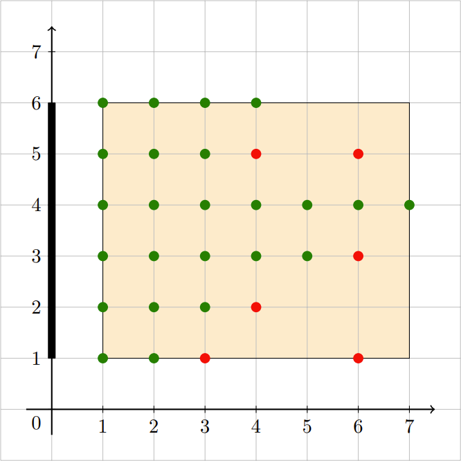

### B:[Spirit Circle Observation](https://ac.nowcoder.com/acm/contest/33186/B)
#### LyFive
**题意**：给一个长度为n个数字串（有前导零）。计算这个数字串中有多少对子串$A,B$（A，B均为可能存在前导零的数字）满足$len(A)=len(B),A = B + 1$。

**思路**：不难发现，我们可以考虑对于一个串$X$不存在9，在$X$后加入一个$i,i+1$就能凑出$A,B$对。由于是对子串的匹配联想到$sam$的$endpos$的性质$endpos$大小意味着某个子串出现的次数，$sam$每一个状态对应一个$endpos$，设此刻为状态$x$分别接收$i,i+1$转移到$x_i,x_j$，此时$x_i,x_j$状态表示的子串恰好凑成$A,B$对，并且对答案的贡献为$x_i,x_j$的$endpos$大小乘积，即$E(x_i)\times E(x_j)$。同时状态$x$表示子串的个数为$len(x)-len(Link(x))$，故状态$x$转移至$x_i,x_j$的答案贡献为

$$
(len(x)-len(Link(x))\times E(x_i)\times E(x_j)
$$

为此，遍历所有的状态判断转移方向累计答案即可。
对于特殊情况含有字符9的状态，考虑9进位后者进1并将9归0，故可以表示为$x_i,x_j$分别转移到$x_i+9,x_j+0$，故对于特殊情况9可以在每次转移到$x_i,x_j$后枚举9的情况。

**Code**：
```cpp
#include <bits/stdc++.h>
using namespace std;

typedef long long LL;
const int N = 8e5 + 10;
int tot = 1, last = 1;
struct Node
{
    int len, fa;
    int ch[10];
} node[N];
char str[N];
LL f[N], ans;
int h[N], e[N], ne[N], idx;

void extend(int c)
{
    int p = last, np = last = ++tot;
    f[tot] = 1;
    node[np].len = node[p].len + 1;
    for (; p && !node[p].ch[c]; p = node[p].fa)
        node[p].ch[c] = np;
    if (!p)
        node[np].fa = 1;
    else
    {
        int q = node[p].ch[c];
        if (node[q].len == node[p].len + 1)
            node[np].fa = q;
        else
        {
            int nq = ++tot;
            node[nq] = node[q], node[nq].len = node[p].len + 1;
            node[q].fa = node[np].fa = nq;
            for (; p && node[p].ch[c] == q; p = node[p].fa)
                node[p].ch[c] = nq;
        }
    }
}

void add(int a, int b)
{
    e[idx] = b, ne[idx] = h[a], h[a] = idx++;
}

void dfs(int u)
{
    for (int i = h[u]; ~i; i = ne[i])
    {
        dfs(e[i]);
        f[u] += f[e[i]];
    }
}

void getAns()
{
    for (int x = 1; x <= tot; x++)
    {
        for (int i = 0; i < 9; i++)
        {
            int q = node[x].ch[i];
            int p = node[x].ch[i + 1];
            while (q && p)
            {
                ans += (node[x].len - node[node[x].fa].len) * f[q] * f[p];
                q = node[q].ch[9];
                p = node[p].ch[0];
            }
        }
    }
}
int main()
{
    int n;
    cin >> n;
    node[0].len = -1;
    scanf("%s", str);
    for (int i = 0; str[i]; i++)
        extend(str[i] - '0');
    memset(h, -1, sizeof h);
    for (int i = 2; i <= tot; i++)
        add(node[i].fa, i);
    dfs(1);
    getAns();
    cout << ans << endl;
    return 0;
}
```
***
### C:[Grab the Seat!](https://ac.nowcoder.com/acm/contest/33186/C)

tags: 单调队列，计算几何

#### z3475

##### 标签

单调队列,计算几何

##### 题意

在二维坐标系中$(1,1)$到$(n,m)$的矩阵包含的整数点为座位，$(0,1)$到$(0,m)$为电视，一个座位为好座位当且仅当它和电视形成的三角形内没有人。给定其他同学坐的位置，每个回合都有一个人移动位置坐，求每个回合后好位子数量。



##### 思路

考虑人对位置的影响，发现一个人$(x,y)$会ban掉所有$(0,1)$到$(x,y)$为方向，以$(x,y)$为开始的射线和$(0,m)$到$(x,y)$的射线围着的座位。考虑一边，另一边可以以同样的方法算出。取min即可。

发现对于所有人形成从$(x,y)$开始的所有以$k$为斜率的射线中，$k$和$y$值构成了一个单调队列like的形式，即如果$k_1>k_2$且其$y_1>y_2$，则前者完全可以替代掉后者，按斜率排序后添加至单调队列就可以维护每一个值对应的最小x值。


??? note "参考代码"
    ```cpp
    --8<-- "docs/sol/nowcoder/schools2022/s1/C.cpp"
    ```

***
### I:[Chiitoitsu](https://ac.nowcoder.com/acm/contest/33186/I)
#### LyFive
**题意**：牌库总共34×4张牌，起手摸13张。玩家每次摸一张牌丢一张牌，直到摸到恰好凑成7对牌后胜利。现求最优策略到达胜利所需摸牌数的期望。

**思路**：不难发现最优策略就是保留手上的单牌，若摸一张不是手上的单牌就丢掉，否则就保留。现设$dp[i][j]$为还缺$i$个对子，牌库还剩下$j$张牌获胜的期望。基于此，不难发现若缺$i$个对子，则手中已有$7-i$个对子，剩下$13 - 2(7-i)=2i-1$张单牌。考虑当前$i,j$状态下摸一张牌，那么这张牌是需要的单牌的概率应该为$p_v = \frac{3(2i-1)}{j}$，不是则为$p_f = 1-\frac{3(2i-1)}{j}$，每次摸牌牌库都会减少1。
因此得到递推式：

$$
dp[i][j] = dp[i-1][j-1]\times p_v + dp[i][j-1]\times p_f
$$

最终判断每次输入有多少个对子$cnt$输出$dp[7 - cnt][123]$即可。

**Code**：
```cpp
#include <bits/stdc++.h>
using namespace std;
typedef long long LL;

const LL mod = 1e9 + 7;
const LL N = 2e5 + 100;

LL t, n, m, x, y, k;
LL dp[8][136]; // 还缺i个对子，牌堆还有j张牌获胜的期望
LL inv[136];
LL ksm(LL x, LL y)
{
    if (y == 0)
        return 1;
    if (y == 1)
        return x % mod;
    LL as = ksm(x, y / 2);
    if (y % 2)
        return as * as % mod * x % mod;
    return as * as % mod;
}

LL mint(LL x)
{
    return x % mod;
}
void init()
{
    for (int i = 1; i < 136; i++)
    {
        inv[i] = ksm(i, mod - 2);
    }
    for (int i = 1; i <= 7; i++)
    {
        for (int j = i; j <= 123; j++)
        {
            dp[i][j] = mint(dp[i - 1][j - 1] + 1) * mint((6 * i - 3) * inv[j]) % mod +
                       mint(dp[i][j - 1] + 1) * mint((j - 6 * i + 3) * inv[j]) % mod;
            dp[i][j] %= mod;
        }
        // cout << dp[i][123] << endl;
    }
}

string s[13];
void solve()
{
    char x[3];

    for (int i = 0; i < 13; i++)
    {
        scanf("%2s", x);
        swap(x[0], x[1]);
        s[i] = x;
    }
    sort(s, s + 13);
    int cnt = 0;
    for (int i = 1; i < 13; i++)
        if (s[i] == s[i - 1])
            cnt++;

    cout << dp[7 - cnt][123] << "\n";
}

int main()
{
    init();
    cin >> t;
    for (int i = 1; i <= t; i++)
    {
        cout << "Case #" << i << ": ";
        solve();
    }
}
```


***
### J:[Serval and Essay](https://ac.nowcoder.com/acm/contest/33186/J)