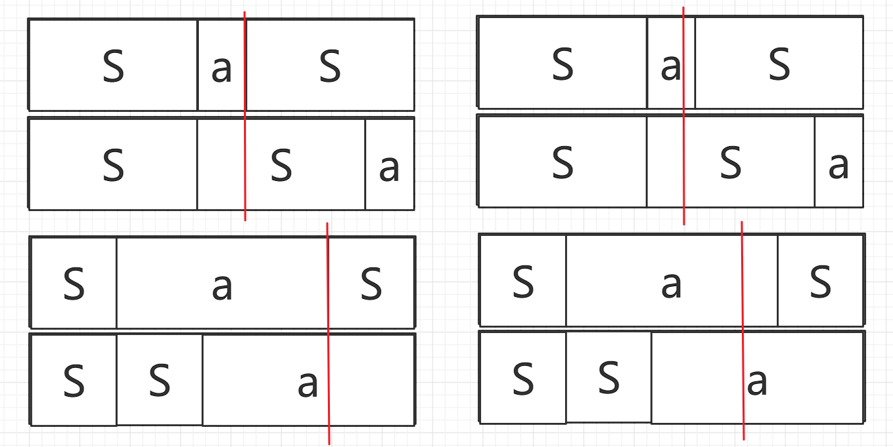

### C:[Concatenation](https://ac.nowcoder.com/acm/contest/33188/C)
#### LyFive
##### 标签
trie树;exkmp;dfs;空间优化

##### 题意
给定$n$个字符串，求$n$个字符串连接后字典序最小的$S$。

##### 思路
最简单的贪心思路能够想到，若$a$的拼接顺序在$b$的前面，则应满足$a+b \leq b + a$。为此最简单的方案是以此为关键字排序，时间复杂度为$O(|S|logn)$。为将复杂度降低至线性，可以考虑如果排序$a,b$。利用贪心思想，①若$a$不是$b$的前缀$(|a| <= |b|)$，则应直接比较$a,b$的字典序，将字典序小的放在前面；②若$a$是$b$的前缀则利用$exkmp$O(1)进行比较。因此具体方案如下：构造$trie$树，根据$trie$树各串的$dfs$序确定①排序，此时目标字符串$str$的前缀集合$STR$已经排序完成，通过比较$str$与每一个存在的前缀$STR_i$的排序关系进行插入排序即可。且不难证明，设所有排在$str$前面的前缀集合为$A$，排在$str$后面的前缀集合为$B$。则$B$集合一定是连续的，即不存在元素$a_i \in A$在$b_j,str$之间。因为$a_i < str,且b_j > str 故顺序为a_i < str < b_j$。因此，核心实现难度为使用$exkmp$比较$str$与$STR$的大小关系。
令$str = Sa$通过$exkmp$我们探讨$Sa$与前缀$S$的排序关系：首先，$exkmp$的$Z$数组$Z[i]$代表以$i$下标开始的后缀与原字符串的最长公共前缀长度。我们将$Sa与S$拼接可得到$SaS$与$SSa$。比较$SaS$与$SSa$的字典序，若前者字典序小则前缀$S$应属于$B$集合，否则属于$A$集合。
比较下面两种情况$Z[|S|]| = |a|$，$Z[|S|] < |a| $

1. 左边：$Z[|S|] = |a|$，此时红线左部分一致，若要比较$SaS,SSa$的字典序关系应为红线右半部分字典序关系。此时红线位置上方相对于$Sa$下标为$|a|$，下方相对于$Sa$下标为0。再次利用$exkmp$的$Z$数组，得到$Z[|a|]$为此只需比较$Sa[Z|a|]$与$Sa[|a|+Z[|a|]]$的大小关系即可。
2. 右边：$Z[|S|] \neq |a|$，此时红线上方相对于$Sa$下标为$|S|+Z[|S|]$。下方相对于$Sa$下标为$Z[|S|]$，同理比较$Sa[|S|+Z[|S|]$与$Sa[|S|]$的大小关系即可。


??? note "参考代码"
    ```cpp
    --8<-- "docs/sol/code/nowcoder/schools2022_3_C.cpp"
    ```


***

### F:[Fief](https://ac.nowcoder.com/acm/contest/33188/F)


***

### H:[Hacker](https://ac.nowcoder.com/acm/contest/33188/H)


***

### J:[Journey](https://ac.nowcoder.com/acm/contest/33188/J)

