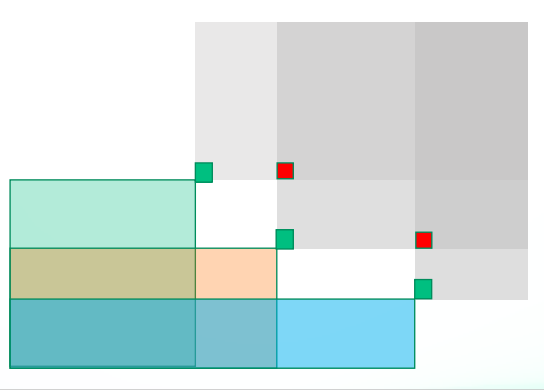

### C:[Easy Counting Problem](https://ac.nowcoder.com/acm/contest/33189/C)

#### z3475

##### 标签

数学；FFT

##### 题意

求$w$个数字，第$i$个数字出现至少$c_i$次的组合数量。

##### 思路

容易得到答案为

$$
\prod_i((\sum \frac{x^j}{j!})-(\sum_{j=0}^{c_i-1}\frac{x^j}{j!}))
$$

将右式看作一个整体，左式即为$e^x$，而$(e^x)^i$的级数第j项即位$\frac{i^j}{j!}$可$O(1)$求出。暴力计算表层的累乘，右式的项相乘使用NTT计算，左式特殊处理即可。

##### 代码

??? note "参考代码"
    ```cpp
    --8<-- "docs/sol/code/nowcoder/schools2022_4_C.cpp"
    ```

***

### E:[Jobs (Hard Version)](https://ac.nowcoder.com/acm/contest/33189/E)

#### z3475

##### 标签

前缀和；单调队列

##### 题意

有n个公司，每个公司有m个职位要求，如果个人能力值三元组$(a_1,a_2,a_3)$都大于职位要求，公司就会给他发offer。q次问一个人收到多少offer。

$n\ge 1e6,\sum m\ge 2e6,q\ge 1e7,1 \le a\le 400$

##### 思路

显然要求$O(1)$回答询问，离线看起来不好搞，如果$O(1)$能够回答询问即必须求出每个(i,j,k)询问对应的公司数。

不考虑复杂度的情况下，每个公司有一个存二进制的三维数组，最终三维数组求和即可（easy ver）。

（hard ver）考虑二维问题，发现职位要求$(a,b)$能代替$(c,d)$时$a\le c \land b\le d$。这是一个单调队列like的问题，经过排除后的操作后，则两维是严格负相关的。对于排序后相邻的(a,b)和(c,d)，其对每个公司的二维二进制数组的影响如图



差分后即绿点++，红点--。开一个全局二维数组，在上面修改即可避免空间过大。整完求个二维前缀和即可。

步入三维，首先不能在全局二维数组上粗暴扩展维度，因为公司数量的合并是非常麻烦的。考虑仍然求每个公司的三维二进制数组，每个公司现在有m个这样的二维问题，发现高度(z轴)为a的平面得到的形状最终要合并所有高度(z轴)为b的平面的形状，$b<a$。考虑按z轴从小到大维护这个形状的数据结构，即可维护成功。同样开全局三维数组，最终求个三维前缀和就行。

##### 代码

??? note "参考代码"
    ```cpp
    --8<-- "docs/sol/code/nowcoder/schools2022_4_E.cpp"
    ```

***

### L:[Black Hole](https://ac.nowcoder.com/acm/contest/33189/L)

