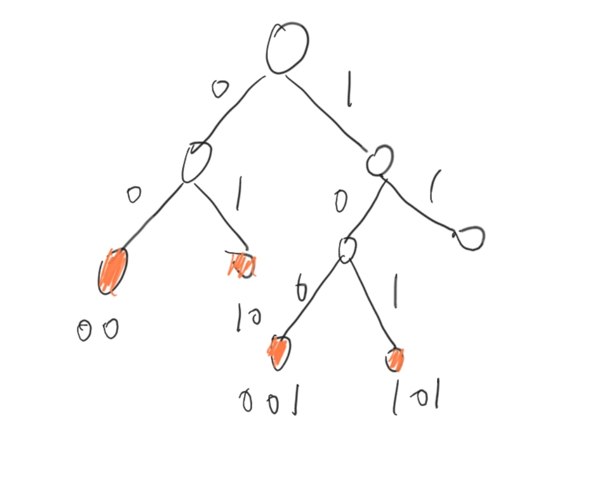

### A:[Array](https://ac.nowcoder.com/acm/contest/33191/A)

#### z3475

##### 标签

构造；数学；哈夫曼树

##### 题意

给定一个长度为$n$的数列$a$，其中$\sum \frac{1}{a_i}\le \frac 1 2$，构造一个0开始的长度为$m$的数列$b_i$，其会产生无限数列$c_i=b_{i\mod m}$。满足$c$中每连续的$a_i$个数字必须包含$i$。

##### 思路

从这个不等式中的2下手

$$
\begin{aligned}
\sum \frac 1 {a_i} &\le \frac 1 2 \\
\sum \frac 1 {\frac {a_i} 2} &\le 1
\end{aligned}
$$

显然变换$a_i$顺序，缩小$a_i$后求解也是符合题意的答案。我们排序后令$a_i$变为$a_i'=2^{\lceil \log_2 a_i \rceil}$。其倒数和不超过1，即可放在一颗01-Tire树上，如$a_i'=8$放在深度为3的节点上，不重复放，以下是$a_i=\{4,5,9,10\},a_i'=\{4,4,8,8\}$的例子。



以下算法可以算出这个例子
```
def dfs(node)
    if a.empty():
        return
    if node.deep == a.front().deep:
        mark
        return 
    dfs(node->lson)
    dfs(node->rson)
```

每个$a_i$的节点所代表的二进制数记为$d_i$

如果$m=2^k$，令$b_i=j\ \text{when}\ i\&d_j=d_j$即可求出。

##### 代码


??? note "参考代码"
    ```cpp
    --8<-- "docs/sol/code/nowcoder/schools2022_6_A.cpp"
    ```

### I:[Line](https://ac.nowcoder.com/acm/contest/33191/I)

##### 标签

线性代数

##### 题意

给$n$个向量$v_i$和$d$，构造出一个点集$S$使每一个点$a\in S$和每一个向量$v$满足其构成的直线上的点集里的点的数量恰好等于$d$。

##### 思路

先找出线性无关的一个向量组，而显然每一个向量可以在整数域内任意放大缩小。

$n=1$，最小点集肯定是一条直线。

$n=2$，一个平行四边形。

发现即为$n$个基向量的线性组合:

$$
S = \{v_1\cdot k_1+v_2\cdot k_2+\cdots+v_n\cdot k_n\ |k_i\in[0,d-1]\cap \Z\}
$$

要求这些**有限的**线性组合组成的**有限的**线性空间具有唯一性。

发现上述每一项$v_i\cdot k_i$在$\{(i,j)|i,j\in[0,36]\}$内，进行类似进制数的操作就有上述唯一性：把$v_i$乘上$37^{(i-1)}$

极限分析

```
; log(6*5*37**5)/log(2)
        ~30.95415742375326743848
```

i32能存的下。

##### 代码

??? note "参考代码"
    ```cpp
    --8<-- "docs/sol/code/nowcoder/schools2022_6_I.cpp"
    ```